# RAGnarok

DSGVO-first, permission-aware RAG assistant over a company's internal documents, on a single PostgreSQL (pgvector + German full-text search).

## Evaluation



## Retrieval strategies (golden set, n=23 answerable)
| Strategie | hit@5 | mrr@5 | context recall | SQL-Latenz (mean) |
|---|---|---|---|---|
| fts | 35% | 16% | 28% | 6.7ms |
| vector | 78% | 54% | 72% | 5.2ms |
| hybrid | 83% | 60% | 74% | 7.1ms |
| rerank | 78% | 63% | 76% | 4692.3ms |
_Embedding: 24.9ms mean (einmal pro Frage) · 2026-10-06T11:41:48.207Z_
__

_Modell: `ministral-14b-latest` · Judge: `zai-org/GLM-5.3-Flash` · Commit: `be9f3e97a`_

## Development

Everything runs via docker compose, no local Node setup:

```bash
cp .env.example .env   # fill in secrets, see Langfuse setup below
docker compose up -d
```

App on http://localhost:3000, Langfuse dashboard on http://localhost:3001.
First start applies migrations, ingests nothing: the chat API returns 503 with
the ingest command until the corpus is loaded, because an empty index would
make the model answer from parametric memory instead of refusing.

Ingest the EUR-Lex corpus (DS-GVO + AI Act):

```bash
docker compose run --rm app npm run cli -- ingest
```

Idempotent: re-running skips already-ingested documents. The same CLI runs the
evals (`evaluate-retrieval`, `judge-generation`, `eval-report`).

### Langfuse setup

Langfuse provisions itself from `.env`: the compose file passes the API key
(`LANGFUSE_INIT_*`) into the Langfuse container, which creates org `ragnarok`,
project `RAGnarok` and the key on startup. The app waits for that key, seeds the
Mistral token prices (cost per answer) and starts tracing every chat request
(retrieval span + generation span).

Manual steps on a fresh install:

1. Generate the keypair into `.env` (two uuids):

   ```bash
   echo "LANGFUSE_PUBLIC_KEY=pk-lf-$(cat /proc/sys/kernel/random/uuid)"
   echo "LANGFUSE_SECRET_KEY=sk-lf-$(cat /proc/sys/kernel/random/uuid)"
   ```

2. Optional UI login (owner of the provisioned org), set in `.env`:

   ```
   LANGFUSE_INIT_USER_EMAIL=you@example.com
   LANGFUSE_INIT_USER_PASSWORD=at-least-8-chars
   ```

3. `docker compose up -d` — dashboard at http://localhost:3001, project
   `RAGnarok`. Without the init user, tracing still works but nobody can log
   into the UI.

The stats line under each answer and the p95/cost chip in the header read
Langfuse via `/api/stats`. Keys stay in `.env`, they grant trace read access.

## MCP

The retrieval stack is exposed over the Model Context Protocol: any MCP client
(Claude Desktop, etc.) can search the corpus with permission enforcement intact.
A dependency-free single-file server (`mcp-server.mjs`) speaks
stdio JSON-RPC and calls the app's HTTP API — retrieval, embeddings and
visibility enforcement stay server-side.

Download mcp server file:
`wget https://github.com/Nutomic/RAGnarok/raw/refs/heads/master/mcp-server.mjs`

Update your harness config:
```json
{
  "mcpServers": {
    "ragnarok": {
      "command": "node",
      "args": [
        "/path/to/mcp-server.mjs"
      ]
    }
  }
}
```

Tools: `list_documents()` for a corpus overview., `search_documents(query, k?, profile?)` for hybrid retrieval.
The API routes behind them are `GET /api/documents` and `GET /api/search`.

## Judge generation

```
# populate JUDGE_ variables in .env
./scripts/integration-test.sh # write retrieval report
./scripts/judge-generation.sh # write generation report
docker compose run --rm -v "$(pwd)/data/eval:/app/data/eval" app npm run cli -- eval-report # generate report svg
```