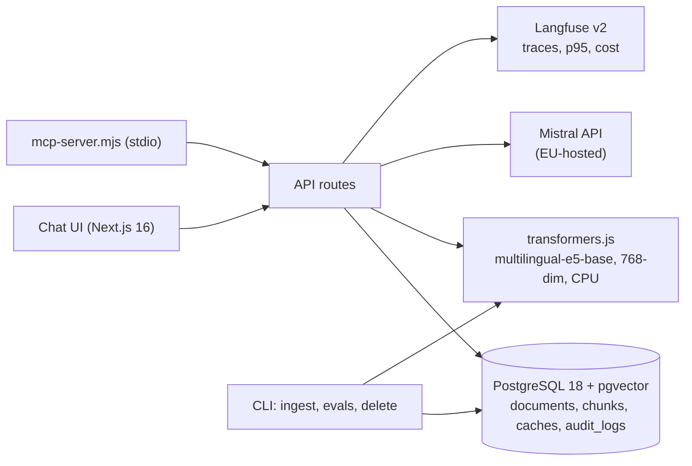

# RAGnarok

[](https://github.com/Nutomic/RAGnarok/actions/workflows/ci.yml)
[](LICENSE)

DSGVO-first, permission-aware RAG assistant over a company's internal documents, on a single PostgreSQL (pgvector + German full-text search).

Companies want an internal assistant over their documents. Then the same four problems show up. Retrieval pulls in documents the asking user has no permission for. Answers invent content. Nobody can trace where a wrong answer came from. Nothing is measured.

RAGnarok is a reference implementation of the parts that fix that: chunk-level permission filtering in the retrieval SQL, citations you can click, refusal when the sources don't cover the question, an audit trail a Datenschutzbeauftragte can read, deletion propagation, and eval numbers that run in CI on every push.

Live demo: [rag.nutomic.com](https://rag.nutomic.com). The demo corpus is the German texts of DS-GVO and the EU AI Act. Two demo profiles are seeded: the default profile sees the AI Act only, the "Compliance" profile sees DS-GVO as well. Same question, different citations, enforced in the retrieval SQL and not the UI (this is a demo switch, not authentication). The stats line under each answer and the p95/cost chip in the header are read from Langfuse. Every answer writes a row to `audit_logs`: prompt, model, retrieved chunk ids, profile, timestamps, token count. Audit view renders this with a cost derived from token prices.

<video src="https://github.com/user-attachments/assets/4d7ebfb8-4495-4d47-8624-c297b0ca4a5a" controls muted></video>


Deletion propagation: the integration test deletes a Danish DS-GVO extract and proves chunks, embeddings and retrievability are gone. Answer-cache rows reference their source documents (`document_ids`), so answers derived from a deleted document are wiped immediately.

<video src="https://github.com/user-attachments/assets/b3313b5b-9c10-4267-913d-c3545fe5106d" controls muted></video>


## Evaluation

### Retrieval strategies (golden set, n=23 answerable)


Metrics over the 23 answerable golden questions, document chunks ranked against EUR-Lex ground truth: hit@5 means a correct chunk appears in the top 5, mrr@5 is how high up it ranks on average, context recall is the share of correct chunks retrieved. fts is Postgres keyword search (`tsvector`, `german` config), vector is pgvector HNSW alone, hybrid fuses both via reciprocal rank fusion, rerank re-scores the hybrid top-k with a cross-encoder.

| strategy | hit@5 | mrr@5 | context recall | SQL-Latenz (mean, including rerank time) |
|---|---|---|---|---|
| fts | 35% | 16% | 28% | 6.7ms |
| vector | 78% | 54% | 72% | 5.2ms |
| hybrid | 83% | 60% | 74% | 7.1ms |
| rerank | 78% | 63% | 76% | 4692.3ms |
_Embedding: 24.9ms mean (einmal pro Frage) · 2026-10-06T11:41:48.207Z_

### Generation (LLM-Judge, n=30)

Answers are generated by Mistral's ministral-14b-latest model, and quality is judged by a different model family (GLM 5.3 Flash) so the judge can't prefer its own style. Faithfulness is the share of claims backed by the retrieved sources, relevancy whether the answer addresses the question, refusal rate how many of the seven abstention questions were declined instead of invented.



| strategy | faithfulness | relevancy | refusal rate |
|---|---|---|---|
| fts | 81% | 70% | 100% |
| vector | 89% | 75% | 100% |
| hybrid | 89% | 85% | 100% |
| rerank | 90% | 92% | 100% |

Generation tracks retrieval: the judge's unsupported-claims lists point at articles retrieval missed, so bad answers trace back to bad retrieval, which the deterministic gate measures.

How it works: 30 German questions drafted from EUR-Lex metadata (15 single-article factual, 8 cross-article, 7 abstention), held in `data/eval/golden.json`. On every push, CI measures the retrieval metrics, checks that no abstention keyword leaks into retrieved chunks, and fails the build when they drop. Generation is judged separately, run locally on demand (`npm run cli -- judge-generation`): LLM-judge calls cost money and are noisy, and nothing changes without a code change, so a scheduled run would be waste.

Note that n=30 means wide confidence intervals. These numbers are a smoke signal and a regression gate, not a benchmark.

## Architecture



One PostgreSQL holds documents, chunks (vector + tsvector + citation metadata), demo profiles, caches and audit logs. Chunks are indexed with HNSW + tsvector german + GIN, the RRF hybrid query is hand-written SQL. The Langfuse database helps determine AI costs, which are shown in the UI. Embeddings run locally on CPU, 25ms per query. Generation goes to the Mistral API, EU-hosted; with a local model in the self-host profile nothing leaves the server. The demo corpus is public EU law under CC BY 4.0 (vendored in `data/eurlex/`).

Deployment profiles:

| Profile | Generation | Embeddings |
|---|---|---|---|
| Full self-host | any OpenAI-compatible endpoint | local CPU |
| Public demo | Mistral API | local CPU |

The MCP server (`mcp-server.mjs`) makes the dataset available to external AI agents. It is dependency-free, speaks stdio JSON-RPC and calls the app's HTTP API, so retrieval, embeddings and visibility enforcement stay server-side. Tools: `list_documents()`, `search_documents(query, k?, profile?)`.

To use it, download the MCP server file (or clone the repo):
`wget https://github.com/Nutomic/RAGnarok/raw/refs/heads/master/mcp-server.mjs`

Update your harness config:
```json
{
  "mcpServers": {
    "ragnarok": {
      "command": "node",
      "args": [
        "/path/to/mcp-server.mjs"
      ]
    }
  }
}
```

The API routes behind the MCP tools are `GET /api/documents` and `GET /api/search`.

## Decisions

**One PostgreSQL, no vector service.** Hybrid search is about ten lines of SQL: pgvector HNSW leg, `tsvector german` leg, reciprocal rank fusion. Nothing extra to operate. `EXPLAIN ANALYZE` on the demo data (840 chunks) showed both legs seq-scan and sort in memory, and that is the planner being right: at that size, a sequential scan beats random heap access. The interesting fix was elsewhere, the final select materialized all 840 chunks through two joins and then discarded most of them; driving the join from the union of candidate ids cut it to 10.0ms with byte-identical results. The HNSW and GIN indexes are unused at this size and that is correct, they engage around 10k+ chunks.

**Hand-written pipeline, no LangChain.** Ingestion, chunking, retrieval and the eval harness are readable in an afternoon, and the evals can measure exactly the interfaces they care about.

**Evals before features.** The most common failure of RAG systems is silent: change the prompt, everything gets worse, nobody notices. The deterministic retrieval gate runs on every push. AI output is treated like any other system output.

**Local embeddings.** multilingual-e5-base (768-dim, quantized) runs on CPU in the app container, 25ms per query, zero marginal cost. Retrieval and embedding stay on the server; only generation goes out, to the Mistral API in the demo profile or a local model in the full self-host profile. German morphology is why hybrid search exists at all: FTS with the `german` config catches compounds and inflection the embedding leg ranks poorly, measured in the table above.

## Limits

- Profile switching is a demo switch, not authentication. Real users, groups and workspaces are post-v0.1 work.
- Ingestion is limited to fixed corpus (EUR-Lex) in HTML format over CLI. Other file types like PDF/DOCS are not supported yet. If untrusted upload functionality is added later, ingested text must be sanitized to avoid prompt injection.
- The generation judge runs locally on demand, not in CI.
- Rerank is off by default: 5s per query is too slow for demo experience.
- Mobile chat auto-scroll doesn't work reliably.
- Chat state is not kept across page reloads.
- n=30 eval set, single public corpus, single instance deployment. This is a reference implementation and not a final product.
- Rate limits are stored in memory only and reset after restart
- Prompts only embed sources for the last user message. Follow-ups ("und Artikel 17?") may retrieve poorly.
- Demo runs on small server with free Mistral tier which can lead to slow responses.

## Development

Everything runs via docker compose:

```bash
cp .env.example .env   # fill in secrets following the comments
docker compose up -d
```

App listens on http://localhost:3000. First start applies migrations automatically. Then ingest the EUR-Lex corpus (DS-GVO + AI Act):

```bash
docker compose run --rm app npm run cli -- ingest
```

Ingest is idempotent, re-running skips already-ingested documents. The same CLI runs the evals (`evaluate-retrieval`, `judge-generation`, `eval-report`) and document deletion.

### Evals locally

```
# general integration test including ingress, deletion, retrieval
./scripts/integration-test.sh
# generation test with AI judge, needs JUDGE_ variables populated in .env
./scripts/judge-generation.sh
# render table + svg for readme
docker compose run --rm -v "$(pwd)/data/eval:/app/data/eval" app npm run cli -- eval-report
```

## License

AGPL-3.0, see [LICENSE](LICENSE). The EUR-Lex corpus in `data/eurlex/` is reproduced under the EU reuse policy (CC BY 4.0), attribution in the directory's README.
